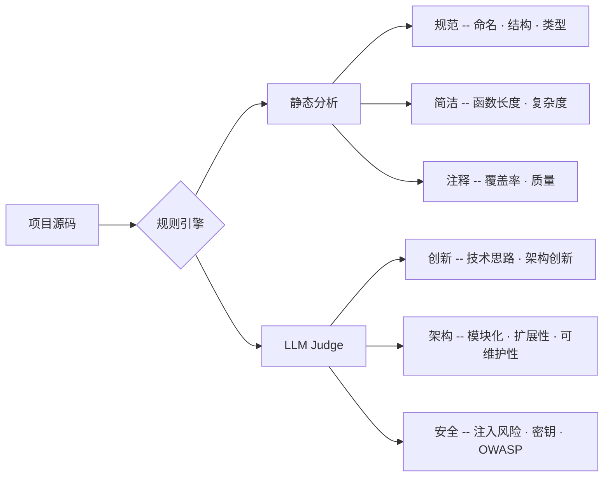

<div align="center">

<br/>


# Code Spec Plugin

**大厂级代码规范与质量治理平台**

</div>

<div align="center">

[](https://github.com/linruoxi666/Code-Spec-Plugin/actions/workflows/ci.yml)
[](https://www.typescriptlang.org/)
[](https://nodejs.org/)
[](./LICENSE)
[](https://modelcontextprotocol.io/)
[](https://github.com/affaan-m/everything-claude-code)

</div>

<br/>

<div align="center">

| [ 快速开始](#-5分钟快速开始) | [ MCP 接入](#-mcp-server) | [ 命令参考](#-完整命令参考) | [ 架构设计](#-技术架构) |
|---|---|---|---|

</div>

---

## 它是什么？

传统的 AI 辅助编程是"写了再说"——生成了不规范代码再去修，低效且不可控。大厂面试官看项目时往往在几秒内就能通过代码结构判断水平。

**Code Spec Plugin** 把"评判标准"前置：在编码前注入规范、编码后量化评分、发现问题即刻修复。一套引擎同时支持 **CLI、MCP Server、VS Code / JetBrains 插件和本地 Web 仪表盘**。

```
编码前 ──► 规范注入 (inject)     生成 .trae/rules、.cursorrules、copilot-instructions
编码中 ──► 实时审计 (MCP / IDE)   AI 助手在写代码时就能感知规范
编码后 ──► 六维评分 (evaluate)    创新·架构·安全·规范·简洁·注释
         ──► 深度审计 (audit)     逐文件问题清单 + 重构建议
```

### 功能矩阵

| 能力 | CLI | MCP | VS Code | JetBrains | Web |
|------|:---:|:---:|:-------:|:---------:|:---:|
| 六维评分 | ✅ | ✅ | ✅ | ✅ | ✅ |
| LLM Judge | ✅ | ✅ | — | — | ✅ |
| 历史记录 | — | — | — | — | ✅ |
| 详细 HTML 报告 | ✅ | — | ✅ | — | ✅ |
| 写前规范注入 | ✅ | ✅ | — | — | — |
| 多语言规则包 | ✅ | ✅ | ✅ | ✅ | ✅ |

---

##  5分钟快速开始

### 前置条件

- Node.js ≥ 18
- （可选）任意 OpenAI 兼容的 API Key，用于 LLM Judge 评分

### 安装

```bash
git clone https://github.com/linruoxi666/Code-Spec-Plugin.git
cd Code-Spec-Plugin
npm install
```

### 三步走

**Step 1 — 初始化项目配置**

```bash
# 进入你自己的项目目录
cd /your/project

# 交互式初始化，选择技术栈和评分偏好
npx tsx /path/to/Code-Spec-Plugin/src/cli.ts init
```

**Step 2 — 评估代码质量**

```bash
# 快速评分（纯静态分析，6个维度）
npx tsx /path/to/Code-Spec-Plugin/src/cli.ts evaluate .

# 启用 LLM Judge，获得创新/架构/安全的深度评分
npx tsx /path/to/Code-Spec-Plugin/src/cli.ts evaluate . --llm
```

**Step 3 — 注入规范配置**

```bash
# 自动生成 AI 编码工具所需的规范文件
npx tsx /path/to/Code-Spec-Plugin/src/cli.ts inject . --write
```

---

## 核心能力

### 六维质量评分



| 维度 | 评估方式 | 默认权重 | 评分依据 |
|------|----------|:------:|----------|
| 创新 | **LLM Judge** | 20% | 原创性、组合创新、技术思路深度 |
| 架构 | **LLM Judge** | 20% | 模块化、扩展性、可维护性、性能设计 |
| 安全 | LLM Judge + 静态规则 | 20% | 密钥泄露、注入、输入校验、依赖风险 |
| 规范 | 静态规则 | 20% | 驼峰命名、导入导出一致性、类型完整度 |
| 简洁 | 静态规则 | 15% | 函数 ≤ 50 行、文件 ≤ 500 行、圈复杂度 |
| 注释 | 静态规则 | 5% | 文档注释覆盖率 (≥ 15%) |

> **智能降级**：LLM Judge 未启用时，创新/架构/安全三个维度自动标记为"未评分"，剩余维度权重归一化，总分不被人为拉低。

### LLM Judge — 大厂面试官视角

LLM Judge 不只是一个打分器，它**模拟大厂面试官的评估思路**：

- **创新维度**：区别原创、组合创新、常规实现、教程复制四个层次
- **架构维度**：从模块化、扩展性、可维护性、安全、性能五个维度深入评估
- **安全维度**：逐项检查硬编码密钥、注入风险、认证缺陷、依赖安全等

每一轮的 prompt 都要求输出：

```json
{
  "score": 8.0,
  "reason": "...",
  "strengths": ["架构分层清晰", "错误处理完整"],
  "weaknesses": ["缺少输入校验", "无访问控制"],
  "suggestions": ["添加中间件校验", "使用环境变量管理密钥"],
  "vulnerabilities": [{ "severity": "HIGH", "description": "..." }]
}
```

### 写前规范注入

根据项目技术栈，自动生成各平台的 AI 编码规范文件：

| 输出文件 | 适用工具 |
|----------|----------|
| `.trae/rules/project_rules.md` | Trae IDE |
| `.cursorrules` | Cursor IDE |
| `.github/copilot-instructions.md` | GitHub Copilot |
| `.code-spec.json` | 项目级评分配置 |

注入的内容包括技术栈约束、命名规范、文件结构约定等，让 AI 辅助编程工具在生成代码时**就遵循项目规范**。

---

##  完整命令参考

### `csi init` — 项目初始化

```bash
npx tsx src/cli.ts init [project-path]
```

交互式流程：

```
? 选择项目技术栈：
◯ TypeScript / JavaScript
◯ React
◯ Vue
◯ Python
◯ Rust
◯ Go

? 是否启用 LLM Judge 对创新、架构、安全维度评分？ Yes

? 选择模型厂商：DeepSeek
? 请输入 API Key： ************
? 请输入模型名称：deepseek-chat
```

初始化后自动生成 `.code-spec.json`：

```json
{
  "techStack": ["typescript", "react"],
  "rulePacks": ["rule-packs/common", "rule-packs/typescript", "rule-packs/react"],
  "enableLlmJudge": true,
  "output": { "format": "json", "language": "zh" }
}
```

### `csi evaluate` — 项目评分

```bash
npx tsx src/cli.ts evaluate <project-path> [options]
```

| 选项 | 说明 |
|------|------|
| `--llm` | 启用 LLM Judge（创新、架构、安全维度） |
| `--rules <paths...>` | 指定规则包路径，多个用空格分隔 |

**静态模式输出示例**：

```json
{
  "totalScore": 8.78,
  "dimensions": [
    { "dimension": "创新",  "score": 0, "issues": [{"message": "LLM Judge 未启用"}] },
    { "dimension": "架构",  "score": 0, "issues": [{"message": "LLM Judge 未启用"}] },
    { "dimension": "安全",  "score": 0, "issues": [{"message": "LLM Judge 未启用"}] },
    { "dimension": "规范",  "score": 7.75, "issues": [{"rule": "naming-convention", "severity": "error"}] },
    { "dimension": "简洁",  "score": 10,   "issues": [] },
    { "dimension": "注释",  "score": 9.2,  "issues": [{"rule": "comment-coverage", "severity": "warning"}] }
  ]
}
```

### `csi inject` — 规范注入

```bash
npx tsx src/cli.ts inject <project-path> --write
```

### `csi config` — 配置管理

```bash
# 查看当前生效配置
npx tsx src/cli.ts config

# 设置全局 LLM（推荐，不进入项目仓库）
npx tsx src/cli.ts config set llm.apiKey    <key>     --global
npx tsx src/cli.ts config set llm.provider  deepseek  --global
npx tsx src/cli.ts config set llm.model     deepseek-chat --global
npx tsx src/cli.ts config set llm.verifySsl false     --global

# 设置项目规则包
npx tsx src/cli.ts config set rulePacks '["rule-packs/common","rule-packs/typescript"]'
```

### `csi mcp` — 启动 MCP Server

```bash
npx tsx src/cli.ts mcp
```

---

##  MCP Server

作为 MCP Server 暴露，可接入 Trae、Cursor、Claude Desktop 等客户端。

### 客户端配置

```json
{
  "mcpServers": {
    "code-spec-plugin": {
      "command": "npx",
      "args": ["tsx", "/path/to/Code-Spec-Plugin/src/cli.ts", "mcp"]
    }
  }
}
```

### 可用工具

| 工具 | 参数 | 说明 |
|------|------|------|
| `evaluate_project` | `path`, `enableLlmJudge?` | 六维评分，返回分数、问题列表、指标 |
| `audit_file` | `path` | 逐文件深度审计，返回优先级排序的改进清单 |
| `generate_coding_guidelines` | `path` | 生成写前规范 Prompt，可直接注入 AI 上下文 |

---

## Web Dashboard

本地运行的 Web 仪表盘，支持项目评分、历史记录对比和问题查看。

```bash
cd web
npm install
npm run dev
```

浏览器访问 http://localhost:8080，后端 API 在 http://localhost:3000。

### 功能

- 输入本地项目路径，一键跑分
- 可选启用 LLM Judge
- 历史记录自动保存到 `~/.code-spec/web/history.json`
- 选择任意两次记录进行维度对比

生产构建：

```bash
cd web
npm run build
npm start
```

---

## 接入国内模型厂商

全部 10 家厂商已内置 preset，无需手动填写 Base URL。

| 厂商 | provider | 默认模型 |
|------|----------|----------|
| OpenAI / Azure | `openai` | `gpt-4o-mini` |
| DeepSeek | `deepseek` | `deepseek-chat` |
| Moonshot (Kimi) | `moonshot` | `moonshot-v1-8k` |
| SiliconFlow | `siliconflow` | `deepseek-ai/DeepSeek-V3` |
| 智谱 AI (GLM) | `zhipu` | `glm-4` |
| 火山引擎 (豆包) | `volcano` | `doubao-lite-4k` |
| 阿里云百炼 | `aliyun` | `qwen-turbo` |
| 百度千帆 | `baidu` | `ernie-lite-v8` |
| 腾讯混元 | `tencent` | `hunyuan-lite` |
| 自定义 | `custom` | _手动输入_ |

```bash
# 以 DeepSeek 为例，三步完成配置
npx tsx src/cli.ts config set llm.provider deepseek --global
npx tsx src/cli.ts config set llm.apiKey   sk-xxx    --global
npx tsx src/cli.ts config set llm.model    deepseek-chat --global
```

### SSL 证书错误处理

国内部分厂商的证书链不完整，可能报 `UNABLE_TO_VERIFY_LEAF_SIGNATURE`：

```bash
# 开发环境可关闭 SSL 校验
npx tsx src/cli.ts config set llm.verifySsl false --global

# 或通过环境变量
export LLM_VERIFY_SSL=false
```

> 底层通过 `undici` 自定义 `fetch` + `Agent({ rejectUnauthorized: false })` 实现，不影响 `openai` SDK 的类型安全。

---

##  技术架构

### 分层设计

```
┌─────────────────────────────────────────────────────────────────┐
│                         适配层 (Adapters)                        │
│                                                                 │
│  ┌──────────┐  ┌──────────────┐  ┌──────────┐  ┌────────────┐  │
│  │   CLI    │  │  MCP Server  │  │ IDE 插件 │  │  Web 应用  │  │
│  │commander │  │  @mcp/sdk   │  │ (计划中) │  │  (计划中)  │  │
│  └────┬─────┘  └──────┬───────┘  └────┬─────┘  └─────┬──────┘  │
│       │               │              │              │          │
├───────┴───────────────┴──────────────┴──────────────┴──────────┤
│                       核心引擎 (Core Engine)                     │
│                                                                 │
│  ┌─────────────────┐  ┌──────────────┐  ┌───────────────────┐  │
│  │  Rule Engine    │  │  LLM Judge   │  │ Guideline Injector│  │
│  │  project-scanner│  │  prompts.ts  │  │  tech-detector    │  │
│  │  rule-parser    │  │  judge.ts    │  │  prompt-builder   │  │
│  │  rule-executor  │  │  consensus.ts│  │  freshness.ts     │  │
│  │  scorer.ts      │  │  schema.ts   │  │  exporter.ts      │  │
│  └────────┬────────┘  └──────┬───────┘  └─────────┬─────────┘  │
│           │                  │                      │           │
├───────────┴──────────────────┴──────────────────────┴───────────┤
│                      分析层 (Analyzers)                          │
│                                                                 │
│  ┌──────────────┐  ┌───────────────┐  ┌─────────────────────┐  │
│  │  AST Checker │  │ Metric Calc   │  │  Linter Aggregator  │  │
│  │  tree-sitter │  │ comments/length│  │  (eslint 集成预留)  │  │
│  └──────────────┘  └───────────────┘  └─────────────────────┘  │
│                                                                 │
├─────────────────────────────────────────────────────────────────┤
│                   规则包层 (Rule Packs)                           │
│                                                                 │
│  ┌───────────┐  ┌──────────────┐  ┌──────────┐  ┌───────────┐ │
│  │  common   │  │  typescript  │  │  react   │  │  python   │ │
│  │ ·密钥检测 │  │  ·命名规范   │  │ ·组件命名│  │ (计划中)  │ │
│  │ ·函数长度 │  │  ·注释覆盖率 │  │ ·组件长度│  │           │ │
│  │ ·README   │  │  ·文件长度   │  │          │  │           │ │
│  └───────────┘  └──────────────┘  └──────────┘  └───────────┘ │
│                                                                 │
└─────────────────────────────────────────────────────────────────┘
```

### 设计原则

- **引擎与适配器解耦**：核心逻辑零 UI 依赖，CLI / MCP / IDE / Web 共享同一套引擎
- **静态 + LLM 混合**：可量化指标用静态规则，主观维度用 LLM，两者互补而非互斥
- **规则包热插拔**：JSON 声明式规则，新增语言/框架只需添加 JSON 文件，引擎代码零改动

### 数据流

```
[源码文件]
    │
    ▼
[ProjectScanner] ──扫描文件树──► [SourceFile[]]
    │
    ├──► [RuleParser] ──加载 JSON──► [RuleDefinition[]]
    │
    └──► [RuleExecutor]
            ├── checkAst()      ── AST 模式匹配
            ├── calculateMetrics() ── 圈复杂度/行数/注释率
            └── runLinter()     ── ESLint 聚合 (预留)
                    │
                    ▼
            [Issue[] + MetricValue[]]
                    │
    ┌───────────────┴────────────────┐
    ▼                                ▼
[Scorer]                        [LLM Judge]
  维度扣分算法                     summar​ize → prompt → OpenAI → schema parse
                    │
                    ▼
            [DimensionResult[]]
                    │
                    ▼
            [EvaluateReport] ── totalScore + 6维度明细
```

### 评分算法

静态维度采用**加权扣分制**：

```
维度得分 = 10 - Σ(规则违规数 × 严重度系数 × 规则权重 × 10)

严重度系数: error = 1.5, warning = 0.8, info = 0.3
```

总分由 6 维加权求和（LLM 未启用时自动归一化剩余维度权重）。

---

## 规则包

### 内置规则明细

<details>
<summary><b>rule-packs/common</b> — 通用规则 (3条)</summary>

| 规则 ID | 维度 | 严重度 | 检测内容 |
|---------|------|:---:|------|
| `README` | 规范 | warning | 项目根目录是否存在 README |
| `no-hardcoded-secrets` | 安全 | error | 硬编码 API Key / Token / Password |
| `function-length` | 简洁 | error | 函数体超过 50 行 |

</details>

<details>
<summary><b>rule-packs/typescript</b> — TypeScript 规则 (3条)</summary>

| 规则 ID | 维度 | 严重度 | 检测内容 |
|---------|------|:---:|------|
| `naming-convention` | 规范 | error | 函数/变量是否使用驼峰命名 |
| `comment-coverage` | 注释 | warning | JSDoc / 文档注释覆盖率 (阈值 15%) |
| `file-length` | 简洁 | warning | 单文件超过 500 行 |

</details>

<details>
<summary><b>rule-packs/react</b> — React 规则 (2条)</summary>

| 规则 ID | 维度 | 严重度 | 检测内容 |
|---------|------|:---:|------|
| `component-naming` | 规范 | error | 组件名是否以大写开头 |
| `component-length` | 简洁 | warning | 单组件超过 300 行 |

</details>

### 新增规则包

只需创建 JSON 文件，无需修改引擎代码：

```json
[
  {
    "name": "python",
    "language": "python",
    "rules": [
      {
        "id": "pep8-naming",
        "dimension": "规范",
        "weight": 0.3,
        "severity": "error",
        "check": {
          "type": "linter",
          "pattern": "snake_case",
          "message": "不符合 PEP8 命名规范"
        }
      }
    ]
  }
]
```

规则定义 schema：

| 字段 | 类型 | 说明 |
|------|------|------|
| `id` | `string` | 唯一标识 |
| `dimension` | `'创新'｜'架构'｜'安全'｜'规范'｜'简洁'｜'注释'` | 所属维度 |
| `weight` | `number` | 规则在维度内的权重 (0-1) |
| `severity` | `'error'｜'warning'｜'info'` | 严重程度 |
| `check.type` | `'ast-query'｜'metric'｜'linter'` | 检查类型 |

---

## 项目结构

```
Code-Spec-Plugin/
├── src/
│   ├── cli.ts                  # CLI 入口，定义所有命令
│   ├── core/
│   │   ├── rule-engine.ts      # 核心编排：扫描 → 执行 → LLM → 评分
│   │   ├── project-scanner.ts  # 文件树扫描，支持 glob pattern
│   │   ├── rule-parser.ts      # JSON 规则包解析与校验
│   │   ├── rule-executor.ts    # 单条规则执行调度
│   │   └── scorer.ts           # 扣分算法与总分计算
│   ├── llm/
│   │   ├── client.ts           # OpenAI SDK 封装，SSL 自定义
│   │   ├── config-helper.ts    # 厂商 preset、交互式 key 输入
│   │   ├── prompts.ts          # 三个维度的 LLM prompt 模板
│   │   ├── judge.ts            # 单次 LLM 评估
│   │   ├── consensus.ts        # 多次评估取共识（降低波动）
│   │   └── schema.ts           # Zod 响应校验
│   ├── rules/
│   │   ├── ast-checker.ts      # tree-sitter AST 模式匹配
│   │   ├── metric-calculator.ts # 复杂度、注释率、行数统计
│   │   └── linter-aggregator.ts # ESLint 聚合（预留）
│   ├── guidelines/
│   │   ├── injector.ts         # 规范注入编排
│   │   ├── tech-detector.ts    # 技术栈自动检测
│   │   ├── prompt-builder.ts   # 各平台规范 Prompt 生成
│   │   ├── freshness.ts        # 技术栈时效性校验
│   │   └── exporter.ts         # 文件写入
│   ├── config/
│   │   ├── manager.ts          # 全局/项目配置读写
│   │   └── types.ts            # 配置类型（含 LlmProvider）
│   ├── commands/
│   │   ├── init.ts             # init 交互命令
│   │   └── config.ts           # config get/set 命令
│   ├── mcp/
│   │   └── server.ts           # MCP Server（3 个 tools）
│   ├── types/
│   │   └── index.ts            # 核心类型定义
│   └── utils/
│       └── file.ts
├── rule-packs/
│   ├── common/                 # 3 条通用规则
│   ├── typescript/             # 3 条 TS 规则
│   └── react/                  # 2 条 React 规则
├── tests/                      # Vitest 测试 (12 文件 / 21 用例)
├── docs/
│   ├── superpowers/specs/      # 设计文档
│   ├── superpowers/plans/      # 各模块实施计划
│   └── references/
│       └── everything-claude-code/  # ECC 原始参考 (MIT)
├── .env.example
└── package.json
```

---

## 开发

```bash
# 开发模式（直接运行 CLI）
npm run dev

# 类型检查
npm run typecheck

# 运行测试（Vitest）
npm test

# 监听模式
npm test -- --watch
```

### 测试覆盖

```
✓ tests/core/project-scanner.test.ts     (3 tests)
✓ tests/core/rule-parser.test.ts         (1 test)
✓ tests/core/rule-executor.test.ts       (1 test)
✓ tests/core/rule-engine.test.ts         (5 tests)
✓ tests/core/scorer.test.ts              (2 tests)
✓ tests/rules/ast-checker.test.ts        (1 test)
✓ tests/rules/metric-calculator.test.ts  (1 test)
✓ tests/llm/schema.test.ts              (1 test)
✓ tests/llm/prompts.test.ts             (1 test)
✓ tests/llm/judge.test.ts              (1 test)
✓ tests/llm/consensus.test.ts           (1 test)
✓ tests/llm/client.test.ts             (3 tests)
────────────────────────────────────────
  Total: 12 files / 21 tests, all passing
```

---

## 与 everything-claude-code 的关系

本项目方法论及以下模块受 [everything-claude-code](https://github.com/affaan-m/everything-claude-code) 启发（MIT License）：

| ECC 概念 | 本项目实现 |
|----------|-----------|
| architect agent | `buildArchitecturePrompt()` — 架构维度 LLM Judge |
| security-reviewer agent | `buildSecurityPrompt()` — 安全维度 LLM Judge |
| code-reviewer agent | 评分中的规范/简洁维度静态规则 |
| no-creds-in-logic rule | `no-hardcoded-secrets` 规则包 |
| function/response limits | `function-length` 规则包 (50行) |

原始参考文件保留在 [`docs/references/everything-claude-code/`](docs/references/everything-claude-code/)。

---

## 设计文档

- [项目设计总纲](docs/superpowers/specs/2026-06-18-code-spec-interview-plugin-design.md)
- [核心规则引擎 + CLI 实施计划](docs/superpowers/plans/2026-06-18-core-rule-engine-cli.md)
- [LLM Judge 实施计划](docs/superpowers/plans/2026-06-18-llm-judge.md)
- [写前规范注入器实施计划](docs/superpowers/plans/2026-06-18-guideline-injector.md)
- [MCP Server 实施计划](docs/superpowers/plans/2026-06-18-mcp-server.md)

---

## 路线图

| 里程碑 | 内容 | 状态 |
|--------|------|:--:|
| M1 核心规则引擎 + CLI | 项目扫描、规则解析、静态评分、CLI 入口 | ✅ |
| M2 LLM Judge | 创新/架构/安全维度、consensus 共识、Zod 校验 | ✅ |
| M3 写前规范注入器 | 技术栈检测、Prompt 生成、多平台导出 | ✅ |
| M4 MCP Server | 3 个 tools 暴露、clients 配置 | ✅ |
| M5 IDE 插件 | VS Code / JetBrains 插件封装 | ✅ |
| M6 Web 应用 | 在线评分、历史对比、团队看板 | 🔲 |
| M7 多语言规则包 | Python、Java、Go、Rust 规则包 | ✅ |

---

## 贡献

欢迎 Issue 和 Pull Request。新规则包贡献只需提交 JSON 文件 + 一条测试。

## 协议

MIT License — 详见 [LICENSE](./LICENSE)。
